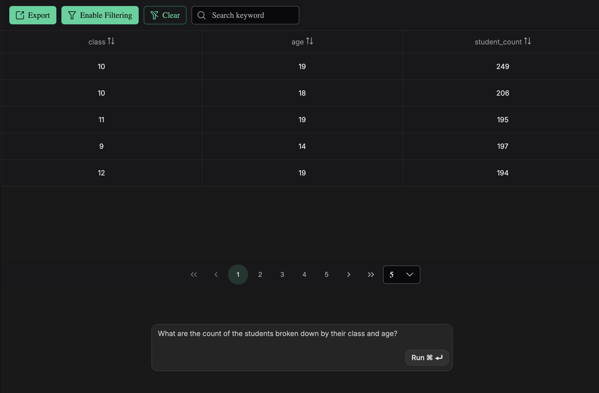
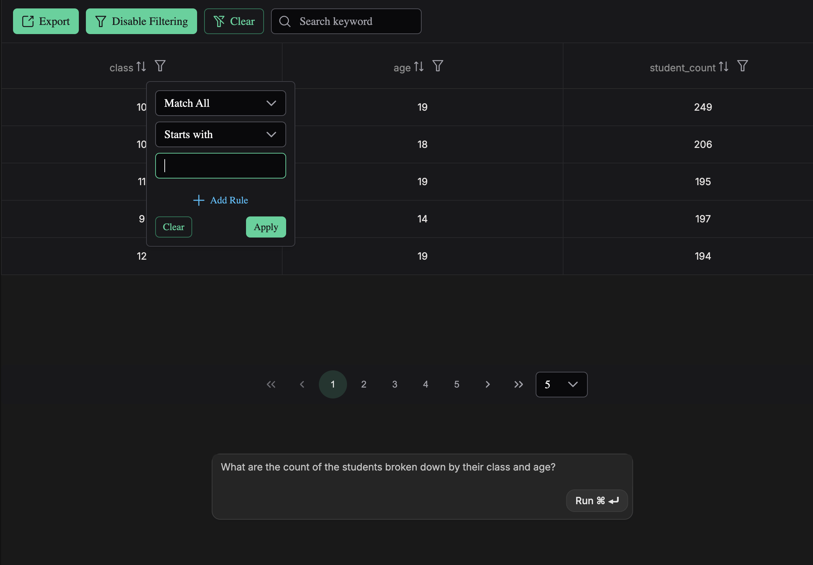
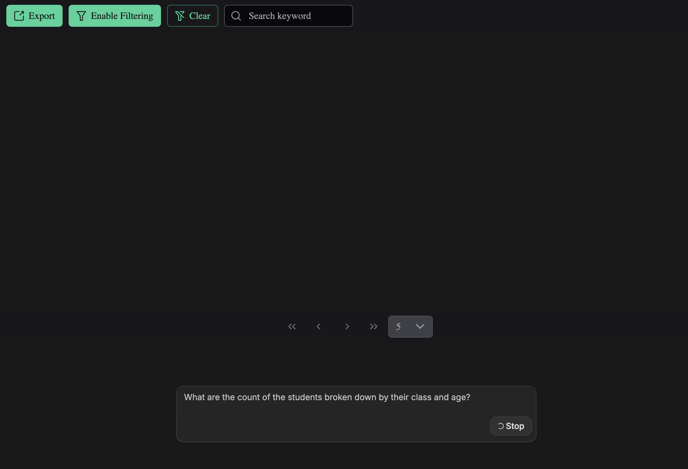

# Natural Language to SQL Explorer

This is a full-stack web application that allows users to query a ClickHouse/Tinybird dataset using natural language. It leverages OpenAI's LLMs with **Constrained Grammar Generation (CFG)** to ensure the generated SQL is syntactically valid and safe before executing it against the data source.

## 🚀 Features

*   **Natural Language Processing:** Convert English questions into complex SQL queries.
*   **Grammar Constraints:** Uses a Lark/Context-Free Grammar definition to force the LLM to output valid, hallucination-free SQL compatible with the specific database schema.
*   **Modern Frontend:** Built with **Angular** and **PrimeNG**, featuring a responsive table to view results and a clean dark-mode UI.
*   **Live Data:** Queries a **Tinybird** (ClickHouse) backend in real-time.
*   **Evaluation Pipeline:** Includes a suite of tools to measure model latency, token usage, grammar validity, and result accuracy against a ground truth dataset.

## 📸 User Interface

The interface is designed for simplicity and efficiency in dark mode.

| **Query Results** | **Advanced Filtering** |
|:---:|:---:|
|  |  |
| *View SQL results in a paginated table* | *Sort and filter specific columns easily* |

| **Processing State** |
|:---:|
|  |
| *Real-time loading feedback with cancellation support* |

## 🛠️ Architecture

*   **Frontend:** Angular 18+, PrimeNG, SCSS.
*   **Backend:** Node.js, Express.
*   **AI/LLM:** OpenAI API (GPT Models) with custom tool definitions for grammar enforcement.
*   **Database:** Tinybird (ClickHouse).
*   **Evaluations:** Python (Pandas, Lark) and Node.js.

---

## 📋 Prerequisites

Before running the project, ensure you have the following installed:

*   **Node.js** (v18 or higher)
*   **npm** (Node Package Manager)
*   **Python 3.10+** (Required only for running evaluations)
*   **Angular CLI** (`npm install -g @angular/cli`)

You will also need API keys for:
1.  **OpenAI**
2.  **Tinybird** (Token and Host URL)

---

## ⚙️ Installation & Setup

### 1. Clone the Repository
```bash
git clone https://github.com/your-username/raindrop-express-app.git
cd raindrop-express-app
```

### 2. Backend Setup
Install the root dependencies:
```bash
npm install
```

### 3. Frontend Setup
Navigate to the client folder and install Angular dependencies:
```bash
cd client
npm install
cd ..
```

### 4. Environment Configuration
Create a `.env` file in the root directory. **Do not commit this file.**

```ini
PORT=3000
OPENAI_API_KEY=sk-proj-YOUR_OPENAI_KEY
TINYBIRD_URL=https://clickhouse.us-east.tinybird.co
TINYBIRD_USERNAME=your_workspace_name
TINYBIRD_PASSWORD=p.YOUR_TINYBIRD_TOKEN
```

---

## ▶️ Running the Application

There are two ways to run the application.

### Option A: Quick Start (Production Build)
Use the provided shell script to build the Angular frontend, copy the assets to the backend's public folder, and start the server.

```bash
# From the root directory
chmod +x run.sh
./run.sh
```
*Access the app at `http://localhost:3000`*

### Option B: Development Mode
If you want to edit the frontend code while the server runs:

1.  **Start the Backend:**
    ```bash
    # Terminal 1 (Root)
    npm start
    ```
2.  **Start the Frontend:**
    ```bash
    # Terminal 2 (Client)
    cd client
    ng serve
    ```
    *Access the app at `http://localhost:4200` (Angular Dev Server)*.  
    *Note: You may need to configure proxy settings in `proxy.conf.json` for the Angular dev server to talk to the Express API port 3000.*

---

## 📊 Running Evaluations

The project includes an evaluation framework to test the accuracy of the LLM's SQL generation against a list of known prompts and ground-truth queries.

### 1. Setup Python Environment
```bash
cd evals
pip install -r requirements.txt
# If requirements.txt doesn't exist, install manually:
# pip install lark clickhouse-connect pandas python-dotenv
cd ..
```

### 2. Run the Full Eval Pipeline
We have defined scripts in `package.json` to make this easy.

*   **Generate Metrics:** Runs prompts through OpenAI and saves raw responses.
*   **Analyze:** Compares the responses against ground truth data using Python.

To run both steps sequentially:
```bash
npm run eval:all
```

**Individual Steps:**
```bash
# Step 1: Generate SQL from prompts (Node.js)
npm run eval:generate

# Step 2: Analyze grammar validity and data accuracy (Python)
npm run eval:analyze
```
### 📈 Evaluation Results

We ran a benchmark evaluation against a test set of prompts. The results highlight the effectiveness of using Context-Free Grammar (CFG) constraints to minimize hallucinations and ensure syntactic validity.

| Metric Category | Metric | Result | Description |
| :--- | :--- | :--- | :--- |
| **Performance** | **Accuracy** | `62.86%` | Fraction of generations yielding factually correct data against ground truth. |
| **Reliability** | **Hallucinations** | `3.03%` | Fraction of invalid SQL grammar generated (significantly reduced due to CFG). |
| **Agent** | **Tool Usage** | `94.29%` | Success rate of the model invoking the custom grammar tool. |
| **Efficiency** | **Avg Latency** | `35.53 ms` | Average generation time across all calls. |
| **Cost** | **Avg Tokens** | `5,096` | Average input + output token count per call. |

### 3. Eval Data Files
*   `evals/test_prompts.txt`: List of natural language questions to test.
*   `evals/test_prompts_ground_truth.txt`: The correct SQL queries corresponding to the prompts.
*   `evals/metrics.json`: The output file generated during the evaluation process.

---

## 📂 Project Structure

```text
raindrop-express-app/
├── app.js                  # Express Server Entry Point
├── run.sh                  # Build and deployment script
├── services/               # Core business logic
│   ├── openai.js           # LLM interaction logic
│   ├── tinybird.js         # Database client
│   └── grammar.js          # Grammar file reader
├── client/                 # Angular Frontend Application
│   ├── src/
│   │   ├── app/            # Components (Prompt, Table, Buttons)
│   │   └── shared/         # Types and shared UI
├── evals/                  # Evaluation Framework
│   ├── eval.py             # Python analysis script
│   ├── generate_metrics.js # Node generation script
│   └── test_prompts.txt    # Eval data
├── mysql_grammar.lark      # The grammar definition file
└── package.json            # Project dependencies and scripts
```

## 🛡️ Grammar Definition
The file `mysql_grammar.lark` contains the **Context-Free Grammar (CFG)**. This is crucial for the application. It restricts the LLM to only generate SQL that adheres to the specific table names, column names, and allowed operations defined in this file, effectively eliminating syntax errors and references to non-existent tables.

## 🤝 Contributing
1.  Fork the repo.
2.  Create a feature branch.
3.  Commit your changes.
4.  Push to the branch.
5.  Create a Pull Request.

## 📄 License
[MIT](LICENSE)
```
